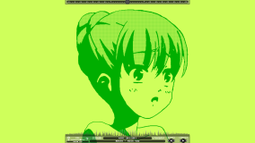
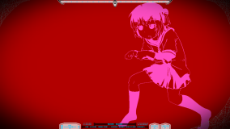
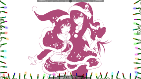
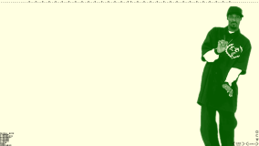
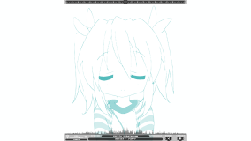
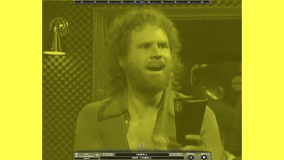

# 0x40-web
A fairly complete HTML5/CSS3 Canvas + Web Audio clone of the 0x40 Hues Flash.

Should work on most modern browsers.

## Example pages:  
[Default Hues  
](http://0x40.mon.im/)  
[420 Hues  
](http://420.mon.im/)  
[Halloween Hues  
](http://spook.mon.im/)  
[Christmas Hues  
](http://xmas.mon.im/)  

You can also have animations that sync perfectly with the beats of the songs. Inspired by Kepstin's Integral experiments.  
[420 Hues, Snoop Edition  
](http://420.mon.im/snoop.html)  
["Montegral"  
](http://0x40.mon.im/montegral.html)  
[More Cowbell  
](https://0x40.mon.im/cowbell.html)  

For some examples of **fast, complicated and fancy** maps, here are some of my personal creations:  
[Black Banshee - BIOS](https://0x40.mon.im/custom.html?packs=BIOS.zip)  
[Drop It](https://0x40.mon.im/custom.html?packs=drop_it.zip)  
[Atols - Eden (buildup only)](https://0x40.mon.im/custom.html?packs=eden.zip)  
[AAAA - Hop Step Adventure](https://0x40.mon.im/custom.html?packs=hopstep.zip)  
[ミュン・ファン・ローン - MACROSS 82-99](https://0x40.mon.im/custom.html?packs=macross.zip)  
[MDK - Press Start (VIP Mix)](https://0x40.mon.im/custom.html?packs=press_start.zip)  
[Alex Centra - Roguebot [Inspected]](https://0x40.mon.im/custom.html?packs=roguebot.zip)  
[Elenne - Vertical Smoke](https://0x40.mon.im/custom.html?packs=smoke.zip)  
[Nicky Flower - Wii Shop Channel (Remix)](https://0x40.mon.im/custom.html?packs=wii_remix.zip)  
[Nhato - Logos](https://0x40.mon.im/custom.html?packs=logos.zip)  

Finally there's these, which hook into the Hues javascript events to do something fresh:  
[Doors](https://0x40.mon.im/doors.html)  
[Does Lewis Have A Girlfriend Yet (xox love ya)](https://0x40.mon.im/lewis.html)  

## Creating your own songs
0x40 Hues comes with an integrated editor to create new songs and inspect existing ones.
[Read how to use it here](https://github.com/mon/0x40-web/blob/master/docs/Editor.md) - it's easier than you think!

## Install (Make your own Hues website)
1. Start by downloading the latest [release](https://github.com/mon/0x40-web/releases). These are minified and load faster.
2. Put your respack zips somewhere they can be found by your web server. My hues have a `respacks/` folder under the main directory.
3. Edit `index.html`:
  1. If your html is in a different location to your `lib` folder:
    * Edit `workersPath` to point to the correct (relative) location.
  3. Edit the `defaults` object so the `respacks` list contains the respacks you wish to load.
  3. *Optional:* Add any extra settings to the `defaults` object.
  4. Upload everything to your server!

### Example settings  
```javascript
var defaults = {
    workersPath : "lib/workers/",
    respacks : ["./respacks/Defaults_v5.0_Opaque.zip", 
                "./respacks/HuesMixA.zip"
                ],
    firstSong : "Nhato - Miss You",
};
```

## Settings object  
See [HuesSettings.js](./src/js/HuesSettings.js#L29) for the possible options you
can put into the `defaults` object.

## Query string
Any setting that can go in the `defaults` object can also be dynamically specified in the URL.
For example: http://0x40.mon.im/custom.html?packs=BIOS.zip,kitchen.zip&currentUI=v4.20

There are two special settings here:
* `firstSong` can just be written as `song`.
* Anything given as `packs` or `respacks` will be appended to the respacks
  specified in the `defaults` object, as opposed to overwriting them.

## Building
Install [Node.js](https://nodejs.org/en/). I used v16, but it should work with newer releases.
Install the required packages for the build:
```bash
npm install
```
Build with `npx webpack`. It will create a `dist` folder. For seamless
development with auto-reload, `npx webpack serve` - if you do this, put any
respacks in `public/respacks` so they're found by the local server.

## Adding a new beat character
There's a few places to change, here's a list:
- The documentation in the INFO tab. Found in HuesInfo.svelte
- The mouseover documentation & button for the beat in EDITOR. Found in HuesEditor/Main.svelte
- The list of beats in HuesCore.ts
- If you've added some new display behaviour:
  - A new beat type in the `Effect` enum
  - A handler in the `beater` function
  - Appropriate state for the effect in HuesRender.ts
  - Appropriate rendering code in HuesCanvas.ts
